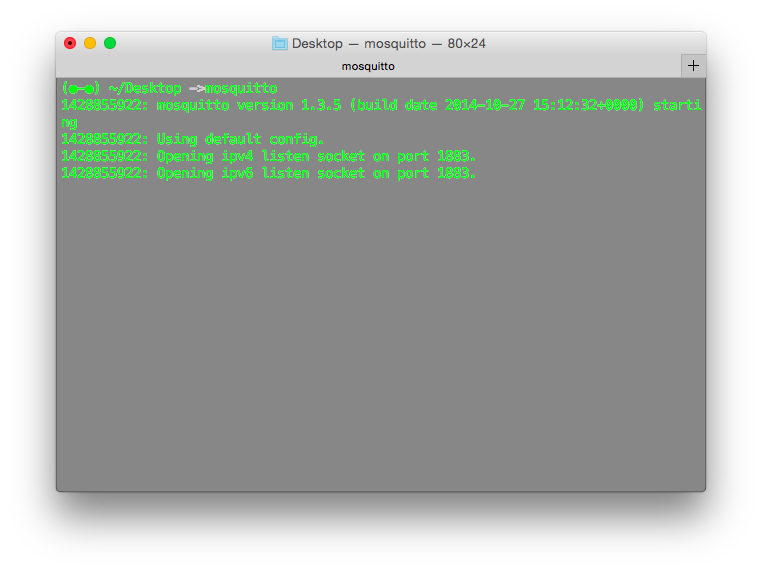
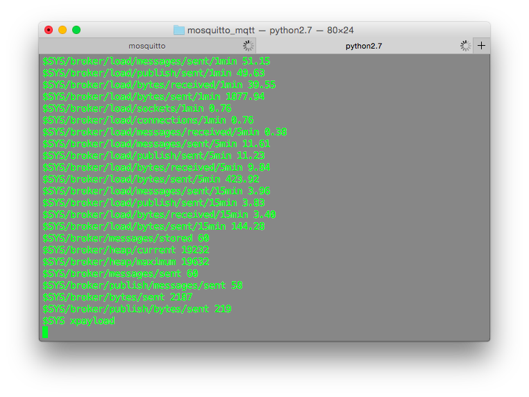
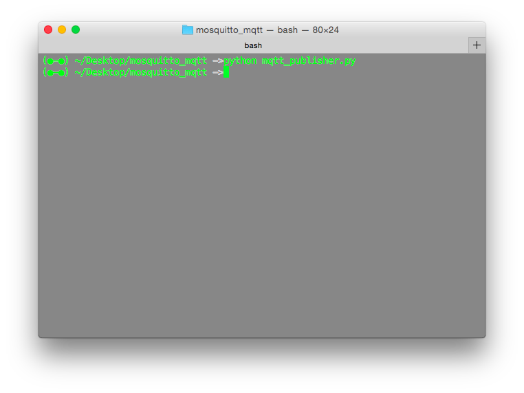

# MQTT Demo

This is a demostration of MQTT protocol. To give a brief illustration, this README is only about Python version demo. Other language version are the same as Python's version.

For Java version you can visit [this](https://github.com/cfliao/2015-mqtt-java-client) project.

For JavaScript version, please checkout [npm](https://www.npmjs.com/package/mqtt) project.

For Scala version, please checkout [here](https://github.com/prabeesh/MQTTScalaClient).

# Prerequisite

* MQTT broker: Mosquitto (yap, an additional 't' there)
	* Ubuntu: `sudo apt-get install mosquitto`
	* OS X: `brew install mosquitto`
	
* The Mosquitto Python Module 
	* `pip install paho-mqtt` 
	* For Java, Scala version, you should download Java libraries [org.eclipse.paho.client.mqttv3](https://repo.eclipse.org/content/repositories/paho-releases/org/eclipse/paho/org.eclipse.paho.client.mqttv3/) and [org.eclipse.paho.mqtt.utility](https://repo.eclipse.org/content/repositories/paho-releases/org/eclipse/paho/org.eclipse.paho.mqtt.utility/)

# Usage
1. You should first launch an MQTT broker server. With instanlling mosquitto, you can launch a server with purely type `mosquitto`.

2. Then use `python  mqtt_subscriber.py` and `python mqtt_publisher.py` respectively.

* Subscriber

* Publisher

# Note 
The publisher will automatically terminate after send a message to broker. To terminate subscriber and broker server, use `ctrl + C` or `control + C` for times.
